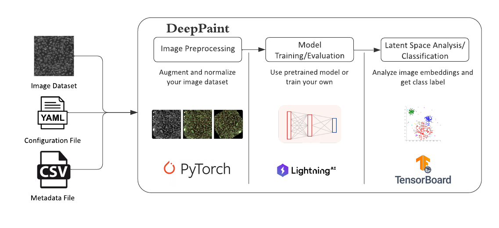

# DeepPaint

A python package dedicated to classification and exploration of Cell Painting data. This package relies on [`lightning`](https://lightning.ai) for training/evaluation of the `DenseNet` model.

## Installation

1. Ensure `Python >=3.11` and `conda` are installed on your machine
    The recommended installer for `conda` is [`miniforge`](https://github.com/conda-forge/miniforge)
2. Clone this repository
    ~~~bash
    $ git clone https://github.com/jhuapl-bio/DeepPaint.git
    ~~~
3. Navigate to the [DeepPaint](.) directory (containing the README)
    ~~~bash
    $ cd DeepPaint
    ~~~
4. Create a `conda` virtual environment from the [`environment.yml`](./environment.yml) file and activate it
    ~~~bash
    $ conda env create -n <env_name> -f environment.yml
    $ conda activate <env_name>
    ~~~
5. Install the `DeepPaint` package with pip
    ~~~bash
    $ pip install .
    ~~~

## Usage (Overview)

The `DeepPaint` package can be run as a module with the command `python -m deep_paint` to invoke the CLI. This is the entry point for training and evaluating models.

## CLI (Command Line Interface)

Four commands are available:
- `fit`: Train or finetune a model
- `validate`: Run one evaluation epoch on a validation set
- `test`: Run one test epoch on a test set
- `predict`: Get predictions from a trained model on part or all of a dataset

These commands correspond to the [lightning.pytorch.Trainer](https://lightning.ai/docs/pytorch/stable/common/trainer.html#methods) methods. All commands can be run with the `--config` argument to specify a configuration file.

### Config File

The configuration files used for training, getting model predictions, and getting model embeddings are available in the [configs](./results/configs/) directory. Ensure to update the paths in the configuration files (they are commented for convenience).

The configuration file is a YAML file that contains all the necessary parameters for training, evaluating, or testing a model. The YAML file is divided into the following fields:

| Field     | Subclass                                                                                                   | Description                                                                                          | Required? |
|--------------|------------------------------------------------------------------------------------------------------------|------------------------------------------------------------------------------------------------------|-----------|
| model        | [`LightningModule`](https://lightning.ai/docs/pytorch/stable/common/lightning_module.html#lightningmodule) | Model architecture and hyperparameters                                                               | ✅         |
| data         | [`LightningDataModule`](https://lightning.ai/docs/pytorch/stable/data/datamodule.html#lightningdatamodule) | Data preprocessing and augmentation                                                                  | ✅         |
| trainer      | [`Trainer`](https://lightning.ai/docs/pytorch/stable/common/trainer.html)                                  | [Training arguments](https://lightning.ai/docs/pytorch/stable/common/trainer.html#trainer-class-api) | ✅         |
| optimizer    | [`Optimizer`](https://pytorch.org/docs/stable/optim.html#torch.optim.Optimizer)                            | Optimizer                                                                                            | ❌         |
| lr_scheduler | [`LRScheduler`](https://pytorch.org/docs/stable/optim.html#how-to-adjust-learning-rate)                    | Learning Rate Scheduler                                                                              | ❌         |
| ckpt_path    | N/A                                                                                                        | Path to model checkpoint                                                                             | ❌         |

All fields except `trainer` and `ckpt_path` require a `class_path` parameter. A full path to the class must be provided. Following this parameter, the rest of the field is parsed as keyword arguments to the class constructor via the `init_args` parameter.

### Example Usage

- Train a model:
    ~~~bash
    python -m deep_paint fit --config /path/to/your_config.yaml
    ~~~
- Run a validation epoch:
    ~~~bash
    python -m deep_paint validate --config /path/to/your_config.yaml
    ~~~
- Run a test epoch:
    ~~~bash
    python -m deep_paint test --config /path/to/your_config.yaml
    ~~~
- Get model predictions:
    ~~~bash
    python -m deep_paint predict --config /path/to/your_config.yaml
    ~~~

### Getting Model Embeddings

A custom script has been created to extract embeddings from a trained model. The script can be run with the following command:
~~~bash
python -m deep_paint.utils.embeddings --config /path/to/your_config.yaml
~~~

This config file looks slightly different than the config file used for the four main commands. Refer to the [configs](./results/configs/) directory for examples.

## Results

### Overview

The [results](./results/) directory contains the following subdirectories:
- `checkpoints`: Contains model checkpoints
- `configs`: Contains configuration files used for training, getting model predictions, and getting model embeddings
- `embeddings`: Contains embeddings extracted from the model on the test set of the `RxRx2` data
- `logs`: Contains csv files extracted from `tensorboard` logs
- `metadata`: Contains custom metadata used for training the `DenseNet` model
- `predictions`: Contains model predictions on the test set of the `RxRx2` data

### Data Availability

The [`RxRx2`](https://www.rxrx.ai/rxrx2) dataset was used for training and evaluation of the `DenseNet` model. The dataset is freely available to download from the [`RxRx.ai`](https://www.rxrx.ai/) website.

### Model Weights

The [checkpoints](./results/checkpoints) directory contains model checkpoints for the binary and multiclass `DenseNet` model. These checkpoints can be used to load the trained models and make predictions.

### Notebooks

The [notebooks](./notebooks/) directory contains Jupyter notebooks that demonstrate the performance of the `DenseNet` model on the `RxRx2` dataset. The notebooks contain visualizations of the model predictions and embeddings.
